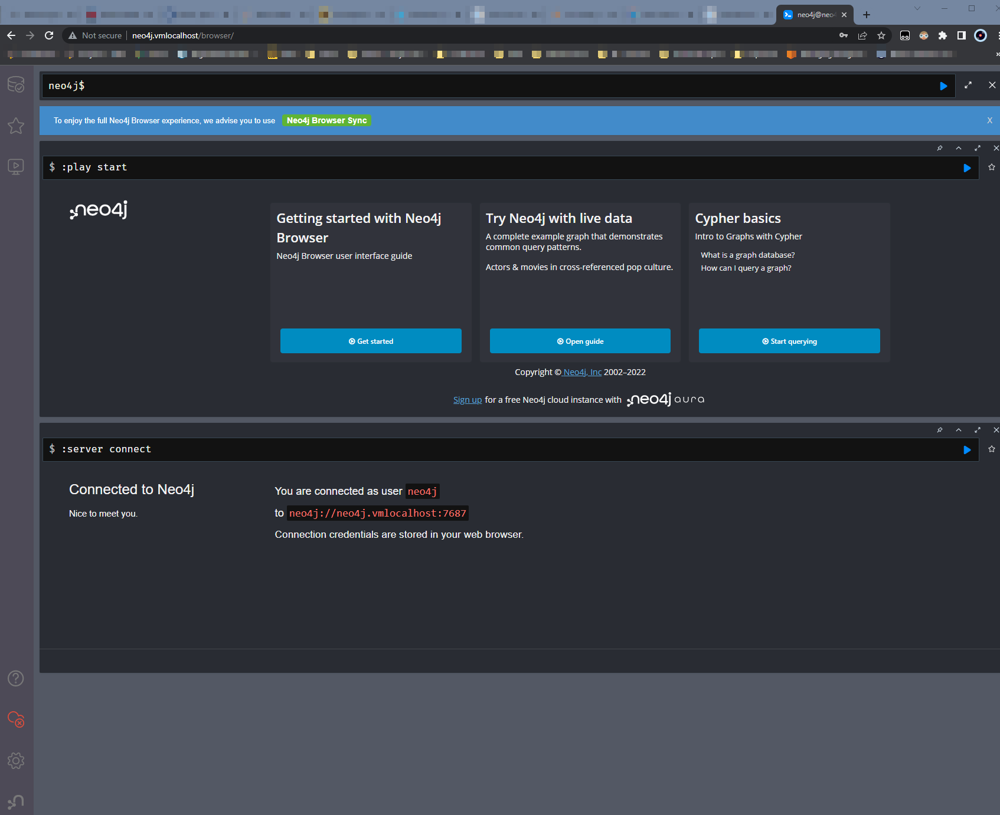
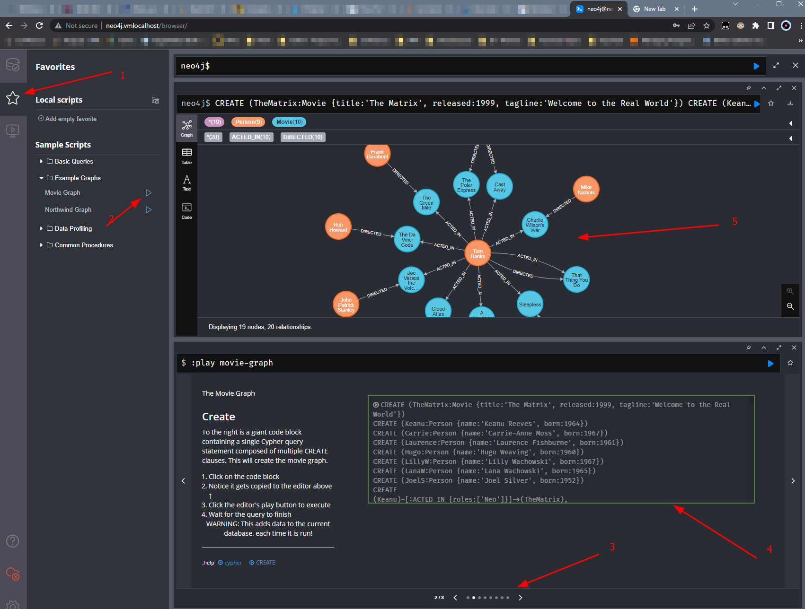

# A simple neo4j test drive

*Date:* 2022-10-21  
*Author:* MvS  
*keywords:* graph database, docker-compose

## Description

Setting up a local instance of the [Neo4j](https://neo4j.com/) database, which persists its data in docker volumes.

## How to use

1. Copy `.env.dist` to `.env` and adjust stack or image specifications if needed

2. Run `make run-compose` and let the container come online.

3. The Neo4j browser GUI should be served under `http://localhost:7474` by default or the respective
local subdomain address.

4. Access to GUI via to following default credentials:

    ```[bash]
    user: neo4j
    password: neo4j
    ```

    

5. Follow the click-sequence shown in the following screenshot to generate a smaple data set.


6. Use <kbd>CTRL</kbd>+<kbd>C</kbd> to shut down the stack

7. Invoke `make clean` to remove the stack
